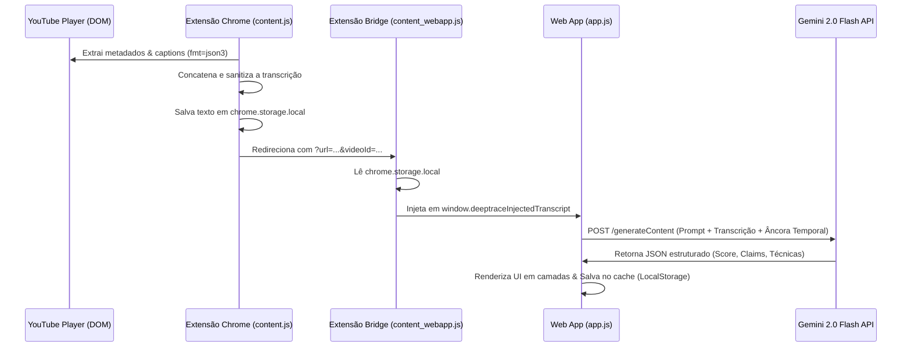

# 🔍 DeepTrace — Engine de Fact-Checking & Combate à Desinformação

[](https://deep-trace-nine.vercel.app)
[](#-extensão-chrome-instalação-local)
[](https://aistudio.google.com)
[](LICENSE)

O **DeepTrace** é uma plataforma híbrida (Web App SPA + Extensão Chrome) projetada para auditar a credibilidade de vídeos e combater a desinformação (*fake news* e *cheapfakes*) na internet. O foco do sistema é o mercado de debates, discursos e entrevistas do cenário eleitoral e jornalístico brasileiro.

Alimentado pelo modelo multimodal **Google Gemini 2.0 Flash**, a aplicação analisa o conteúdo semântico das falas e alegações factuais, confrontando informações duvidosas e gerando relatórios de credibilidade estruturados em tempo real.

---

## 🎯 Nossa Intenção & Abordagem

Ao contrário de abordagens puramente visuais (que tentam detectar deepfakes apenas analisando pixels e são caras de manter no navegador), o **DeepTrace foca no conteúdo da notícia e na argumentação factual**. 

Detectamos a desinformação analisando as falas transcritas dos vídeos. Para isso, criamos uma **arquitetura de integração híbrida**: a extensão do Chrome extrai as legendas diretamente da página do player do YouTube (onde não há restrições de CORS) e as injeta no Web App, permitindo que a IA faça um fact-checking preciso do que foi dito, inclusive em vídeos recém-publicados.

---

## 🏗️ Arquitetura do Sistema & Fluxo de Dados

A aplicação opera de forma 100% *client-side* (Serverless/Static), priorizando a privacidade do usuário (a chave de API e o histórico nunca saem do navegador).



---

## ✨ Funcionalidades Principais

* **Extração de Legendas Client-Side**: A extensão Chrome captura a transcrição textual de vídeos do YouTube em formato limpo (`json3`) sem necessidade de proxy ou backend.
* **Checagem de Fatos em Camadas**:
  * **Camada 1 (Score Geral)**: Pontuação de 0 a 100 com termômetro animado, veredito conceitual e resumo executivo.
  * **Camada 2 (Audit de Alegações)**: Isolamento das alegações individuais extraídas do áudio com análise de confiabilidade (%), fontes oficiais de fact-checking e explicações lógicas detalhadas.
  * **Camada 3 (Mapeamento de Manipulação)**: Identificação de truques retóricos comuns (ex: descontextualização temporal, apelo emocional, cherry-picking).
  * **Camada 4 (Transcrição & Metadados)**: Exibição da transcrição com o badge indicativo de importação via extensão.
* **Âncora Temporal Dinâmica**: O motor do prompt injeta a data/hora real em tempo real para evitar alucinações comuns de IA sobre o ano corrente (ex: alegar que "ainda estamos em 2024").
* **Detecção de Deepfake (Upload Local)**: Permite o upload de arquivos de vídeo de até 50MB. O arquivo é enviado como `inline_data` para análise multimodal completa dos frames.
* **Histórico com Cache local FIFO**: Salva até 50 análises anteriores no LocalStorage, garantindo carregamento instantâneo.

---

## 🛠️ Tecnologias Utilizadas

* **Front-end**: HTML5 Semântico, Vanilla CSS (com variáveis CSS customizadas, blur-effects, CSS Grid e Flexbox) e ES6+ JavaScript.
* **Modelos de IA**: API do Google Gemini (`gemini-2.0-flash`).
* **Chrome Extensions API**: Manifest V3, Content Scripts contextuais, runtime de mensagens isoladas e `chrome.storage.local` para comunicação cross-origin.

---

## 📂 Estrutura do Projeto

```
deepTrace/
├── index.html                 # Interface SPA principal e metadados SEO
├── index.css                  # Design System, variáveis do tema dark/cyan e animações
├── CHROMEWEBSTORE.md          # Documentação para publicação da extensão
├── README.md                  # Documentação principal da engenharia do projeto
├── assets/
│   └── logo.png               # Logo oficial do DeepTrace
├── js/
│   ├── app.js                 # Orquestrador SPA e gerenciamento de listeners
│   ├── analyzer.js            # Engine de compilação de prompt e requisições HTTP da API Gemini
│   ├── ui.js                  # Renderizador dinâmico de blocos HTML, gauges SVG e toasts
│   └── storage.js             # Módulo de persistência FIFO, API keys e mocks de demonstração
└── extension/
    ├── manifest.json          # Declaração do Manifest V3, permissões e scripts
    ├── content.js             # Script injetado no YouTube para capturar legendas
    ├── content_webapp.js      # Script ponte para transferir dados da extensão ao site
    ├── popup.html             # UI do popup da barra de ferramentas
    ├── popup.js               # Lógica de redirecionamento e mensagens do popup
    └── icons/                 # Ícones da extensão (gerados pelo navegador)
```

---

## 🚀 Execução do Projeto

A aplicação web está publicada e pronta para uso em:  
👉 **[https://deep-trace-nine.vercel.app](https://deep-trace-nine.vercel.app)**

### Executando o Web App Localmente (Desenvolvimento)
Como a aplicação utiliza módulos ES6 nativos, ela precisa rodar sob um servidor estático para evitar restrições de segurança do navegador ao carregar arquivos locais (`file://`).

1. Clone este repositório e navegue até a pasta:
   ```bash
   cd deepTrace
   ```
2. Inicie um servidor HTTP local de desenvolvimento:
   ```bash
   # Com Python 3
   python3 -m http.server 8000
   
   # Ou usando o Node (instalando http-server)
   npx http-server -p 8000
   ```
3. Abra no navegador: `http://localhost:8000`

---

## 🔌 Extensão Chrome (Instalação Local)

Para habilitar a captura automática de legendas e análises a partir de links, instale a extensão localmente:

1. No Google Chrome, acesse o painel de extensões digitando na barra de navegação:
   ```
   chrome://extensions/
   ```
2. Ative a chave **"Modo do desenvolvedor"** (canto superior direito).
3. Clique em **"Carregar sem compactação"** (canto superior esquerdo).
4. Selecione a pasta **`extension/`** localizada no diretório do projeto.
5. Pronto! A extensão está ativa e já está integrada à URL de produção na Vercel.

---

## 🔒 Segurança de Chaves de API

Para manter a simplicidade arquitetural e evitar custos de servidor, o DeepTrace **não armazena as chaves de API do Gemini em servidores terceiros**.
* A chave inserida pelo usuário é salva diretamente no `localStorage` do próprio navegador do usuário.
* Todas as requisições para a API da Google Language Platform são feitas de forma direta e assíncrona do próprio navegador do cliente.
* Nenhum dado de requisição ou análise é interceptado por intermediários.
